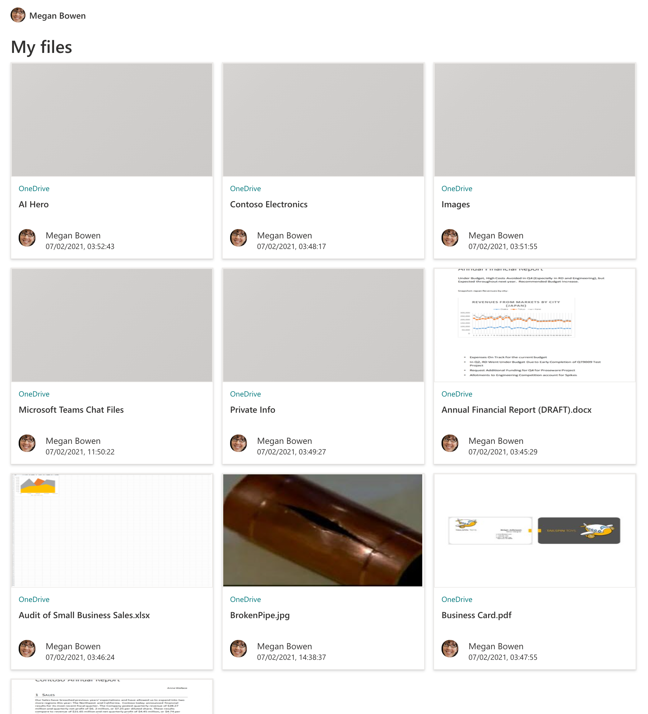

# mgt-htwoo-files

Sample repo that shows how to use [Microsoft Graph Toolkit](https://docs.microsoft.com/graph/toolkit/get-started/overview?tabs=html&WT.mc_id=m365-31754-wmastyka) to render a list of files as document cards using [hTWOo](https://lab.n8d.studio/htwoo/).

## Prerequisites

To run this app, you'll need:

- [Microsoft 365 developer tenant](https://docs.microsoft.com/office/developer-program/microsoft-365-developer-program?WT.mc_id=m365-31754-wmastyka)
- Node.js installed locally

## Minimal path to awesome

- clone the repo
- in the terminal run `npm start`

## Resources

- folder photo by <a href="https://unsplash.com/@laikanotebooks?utm_source=unsplash&utm_medium=referral&utm_content=creditCopyText">Laika Notebooks</a> on <a href="https://unsplash.com/s/photos/folder?utm_source=unsplash&utm_medium=referral&utm_content=creditCopyText">Unsplash</a>
- otter photo by <a href="https://unsplash.com/@mana5280?utm_source=unsplash&utm_medium=referral&utm_content=creditCopyText">mana5280</a> on <a href="https://unsplash.com/s/photos/otter?utm_source=unsplash&utm_medium=referral&utm_content=creditCopyText">Unsplash</a>